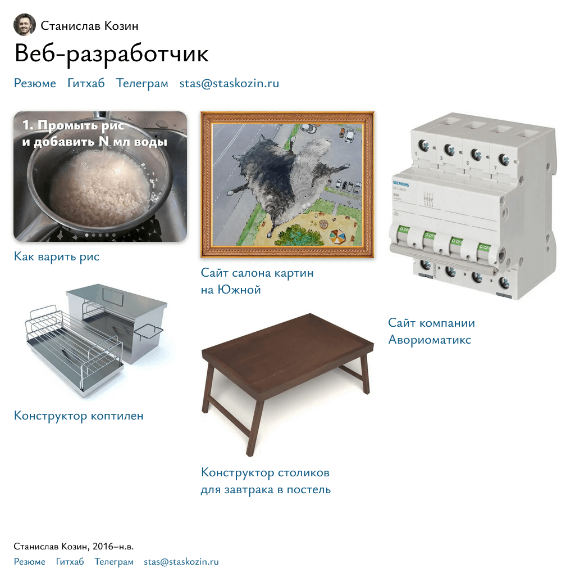
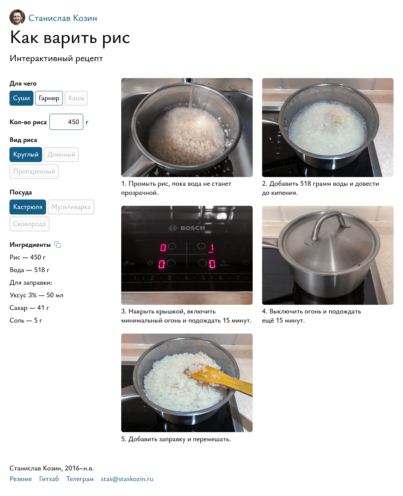

# Мой сайт

❕ Это старая версия сайта. [Новая версия](https://github.com/staskozin/website-vue)

https://staskozin.ru

Работает на [Next.js](https://nextjs.org/), создан через [`create-next-app`](https://github.com/vercel/next.js/tree/canary/packages/create-next-app).

## Скриншоты

### Главная страница
[](https://staskozin.ru)

### Интерактивный рецепт риса
[](https://staskozin.ru/rice-calculator)

## Команды

### `dev`
Запускает приложение в режиме разработки.
```sh
npm run dev
# next dev
```

### `build`
Собирает приложение.
```sh
npm run build
# next build
```

### `start`
Запускает сайт на `localhost:3008`.
```sh
npm run start
# next start -p 3008
```
